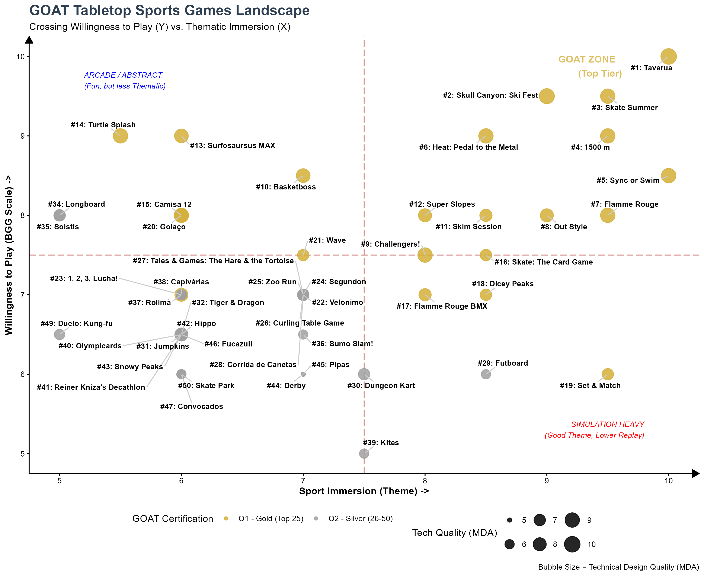
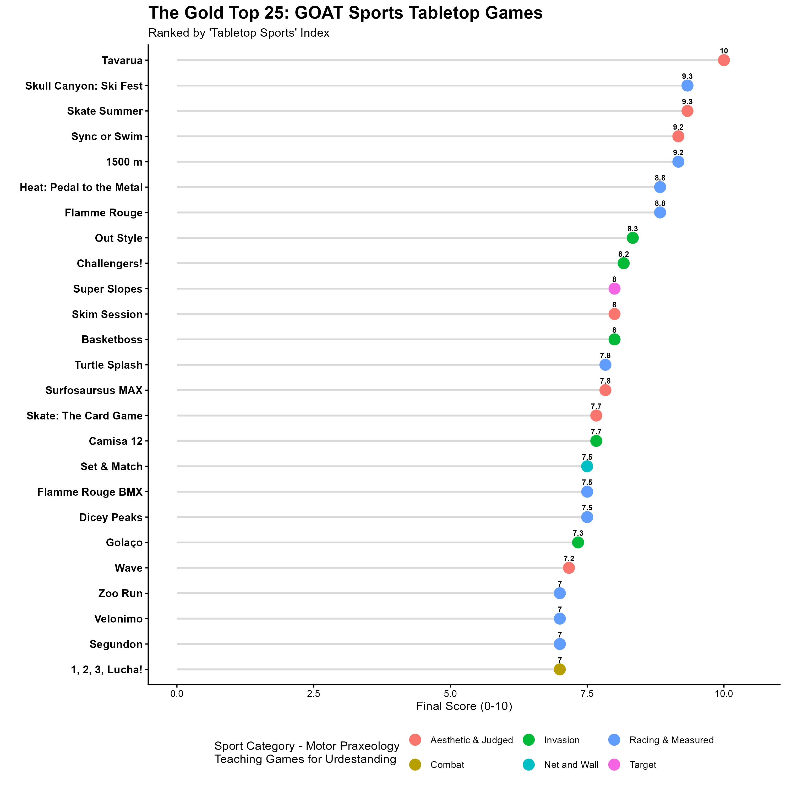
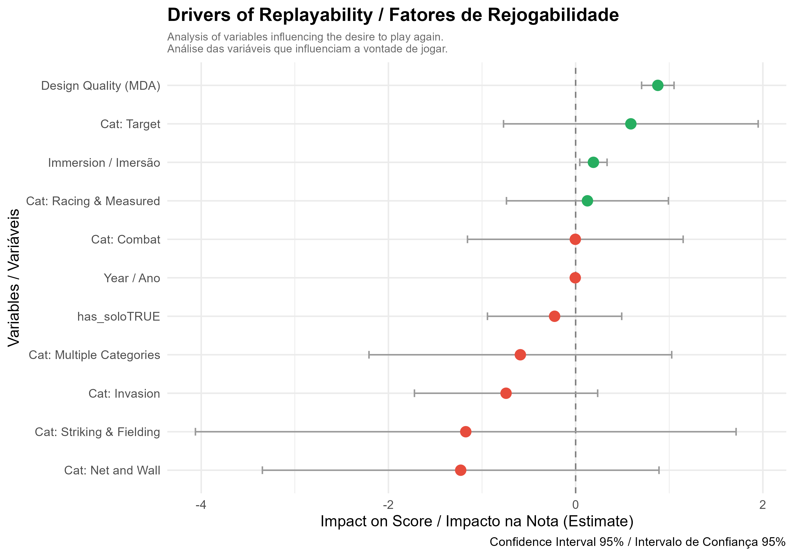
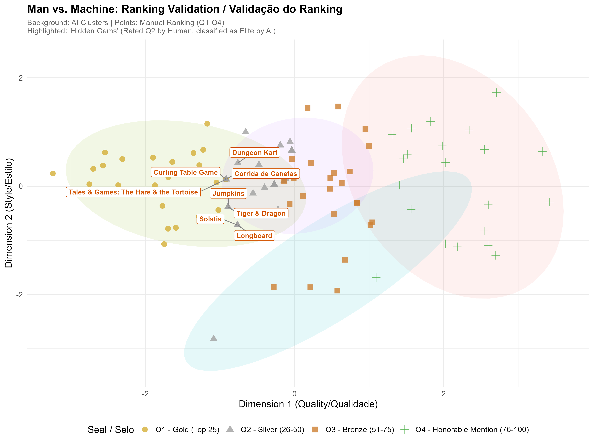

# 🎲 GOAT Sports Tabletop Games: Data Analysis Project

> **"Where Sports Science meets Board Game Design."**

## 📋 Overview

**GOAT Sports Tabletop Games** is a data science project developed to analyze, rank, and classify a **personal collection** of sports-themed board games.

Instead of using external aggregated metrics, this project applies a specific methodology based on **Sports Taxonomy** (Invasion, Target, Racing, etc.) and **Self-Reported Metrics** to visualize the intersection between game mechanics and personal enjoyment.

The goal is to answer: *Which board games best simulate the feeling of real sports while maintaining high willingness to play?*

---

## ⚙️ Methodology & Metrics

The analysis is built upon a curated dataset of ~100 games, evaluated on three core pillars:

1.  **MDA Quality (Mechanics, Dynamics, Aesthetics):** Technical design evaluation.
2.  **Sports Immersion Rate:** How well does the game simulate the real sport's logic?
3.  **Willingness to Play:** A subjective metric quantified strictly following the **BoardGameGeek (BGG) Rating Standards**:
    * **10 (Outstanding):** Always willing to play.
    * **7 (Good):** Usually willing to play.
    * **5 (Average):** Average game, slightly boring, take it or leave it.

### The "Sport on the Table" Index
A composite score is calculated to determine the **GOAT (Greatest of All Time)** status, categorizing games into quartiles:
* 🥇 **Q1 - Gold (Top 25):** The Gold Standard.
* 🥈 **Q2 - Silver (26-50):** Excellent implementations.
* 🥉 **Q3 - Bronze (51-75):** Recommended experiences.
* 🟢 **Q4 - Horable Mention (76-100):** Honorable mentions.

---

## 🚀 The Pipeline (R Scripts)

The project is structured as a modular Data Science pipeline:

| Script | Description | Output |
| :--- | :--- | :--- |
| `01_load_data.R` | ETL process. Imports raw Excel data and cleans naming conventions. | `sports_db` object |
| `02_ranking_certification.R` | **The Algorithm.** Calculates the Index and assigns Q1-Q4 seals. | `processed_ranked_games.rds` |
| `03_dashboard_GOAT.R` | **Data Viz.** Generates the GOAT Matrix and Category Comparisons. | `plots/02_goat_matrix_white.png` |
| `04_social_media_export.R` | **Automation.** Loops through categories to generate Instagram assets. | `plots/insta_cat_*.png` |
| `05_export_reports.R` | **Reporting.** Generates the official Excel and Interactive HTML table. | `ranking_esporte_na_mesa.html` |
| `06_machine_learning_insights.R` | **Advanced Analysis.** Regression (Feature Importance) and K-Means Clustering. | Statistical Insights |

---

## 📊 Visual Gallery

### 1. The Strategic Matrix (Immersion vs. Replayability)
*Analysis of the trade-off between "Simulating the Sport" and "Fun Factor".*
 

### 2. The Elite 25 (Lollipop Chart)
*The top-tier games ranked by the composite index.*

---

## 🤖 Machine Learning Insights

Beyond descriptive statistics, we applied Machine Learning algorithms to audit the manual ranking and uncover hidden patterns in the collection.

### 1. Drivers of Replayability (Linear Regression)
*What actually makes a sports game hit the table again?*

We ran a multivariate regression to identify significant predictors of the "Replayability" score.

**Key Findings:**
* **MDA is King:** Technical design quality (MDA) is the strongest statistical predictor of replayability. A broken game, no matter the theme, won't be played twice.
* **Immersion Matters:** The feeling of "being in the sport" is the second most significant factor.
* **The Solo Myth:** Contrary to industry trends, the presence of a **Solo Mode** (`has_solo`) showed **no statistical correlation** with higher replayability scores in this specific dataset.
* **Category Bias:** Games in the **Target** category show a high potential for fun, though with high variance.

### 2. Man vs. Machine (K-Means Clustering)
*Does the computer agree with the manual ranking?*

We used unsupervised learning (K-Means, k=4) to group games based solely on their mathematical scores, without knowing the official ranking.

* **Validation:** The AI-identified "Elite Cluster" had a **90%+ overlap** with the manual **Q1 (Gold)** ranking, validating the robustness of the methodology.
* **Hidden Gems:** The algorithm identified 8 games that were manually rated as **Q2 (Silver)** but mathematically belong to the **Elite**. These are excellent titles that missed the top spot by a fraction:
    * *Dungeon Kart, Curling Table Game, Corrida de Canetas, The Hare & the Tortoise, Jumpkins, Tiger & Dragon, Solstis, Longboard.*

---

## 🛠️ Tech Stack

* **Language:** R (4.x)
* **Core Libraries:** `tidyverse`, `janitor`, `readxl`
* **Visualization:** `ggplot2`, `ggrepel`, `ggalt`
* **Reporting:** `reactable`, `htmlwidgets`
* **Modeling:** `cluster`, `factoextra`, `broom`

---

## 📂 Data Dictionary (Dicionário de Dados)

Understanding the variables in the dataset (`data/processed_ranked_games.rds`):

| Variable (Coluna) | Description (Descrição) | Type |
| :--- | :--- | :--- |
| `game_name` | Official name of the board game. | Text |
| `publication_year` | Year the game was released. | Number |
| `sport_category` | Classification based on BNCC/Taxonomy (e.g., Invasion, Racing, Target). | Category |
| `sports` | Specific sport(s) depicted (e.g., Cycling, Football). | Text |
| `mda_rate` | **Mechanics, Dynamics, Aesthetics.** Technical design score (0-10). | Number |
| `sports_immersion_rate` | **Immersion.** How well it simulates the sport's logic (0-10). | Number |
| `replayability` | **Willingness to Play.** Subjective metric correlated with BGG desire to play (0-10). | Number |
| `final_score` | **Sport on the Table Index.** Average of MDA + Immersion + Replayability. | Number |
| `rank_position` | The game's ranking based on the Final Score (#1, #2...). | Number |
| `certification_seal` | **GOAT Status.** Calculated quartile (Q1-Elite, Q2-Gold, etc.). | Category |

---

## 👨‍🏫 Author

**Diego Antunes**
* *PhD Candidate | Federal University of Santa Catarina (UFSC)*
* *Researcher in Paralympic Sports, Biomechanics and Physiology*
* *Board Game Enthusiast & Designer*

---

*This project is part of the "Esporte na Mesa" initiative.*