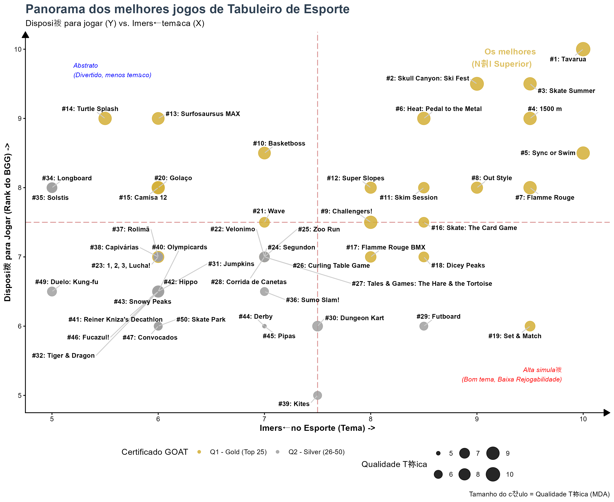
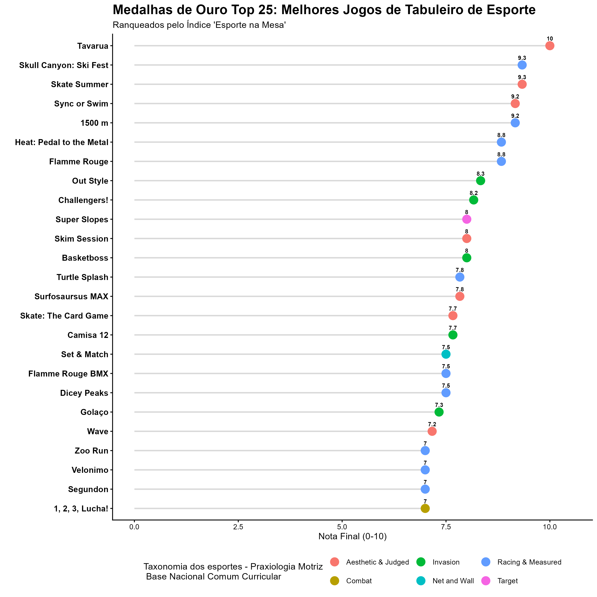

---
output:
  html_document: default
  word_document: default
  pdf_document: default
---
# 🎲 GOAT Sports Tabletop Games: Projeto de Análise de Dados

> [🇺🇸 Read this documentation in English](README.md)

> **"Onde a Ciência do Esporte encontra o Game Design de Tabuleiro."**

## 📋 Visão Geral

**GOAT Sports Tabletop Games** é um projeto de ciência de dados desenvolvido para analisar, ranquear e classificar jogos de tabuleiro com temática esportiva. Diferente de rankings tradicionais (como o do BoardGameGeek), este projeto aplica uma metodologia específica baseada na **Taxonomia dos Esportes** (BNCC - Invasão, Marca, Alvo, etc.) e princípios de Game Design (Framework MDA).

O objetivo é responder: *Qual jogo de tabuleiro melhor simula a lógica do esporte real enquanto mantém uma alta rejogabilidade?*

---

## ⚙️ Metodologia e Métricas

A análise foi construída sobre uma base de dados própria com ~100 jogos, avaliados em três pilares centrais:

1.  **Qualidade MDA (Mecânica, Dinâmica, Estética):** Avaliação técnica do design e regras.
2.  **Imersão Esportiva (Sports Immersion):** O quão bem o jogo simula a lógica e a física do esporte real?
3.  **Rejogabilidade (Replayability):** A vontade de jogar novamente (correlacionada com dados do BGG).

### O Índice "Esporte na Mesa"
Uma nota composta é calculada para determinar o status **GOAT (Greatest of All Time)**, categorizando os jogos em quartis:
* 🥇 **Q1 - Ouro (Top 25):** O Padrão Ouro. A excelência em simulação e diversão.
* 🥈 **Q2 - Prata (26-50):** Implementações excelentes.
* 🥉 **Q3 - Bronze (51-75):** Experiências recomendadas.
* 🟢 **Q4 - Menção Honrosa (76-100):** Menções honrosas.

---

## 🚀 O Pipeline (Scripts em R)

O projeto está estruturado como um pipeline modular de Data Science:

| Script | Descrição | Saída (Output) |
| :--- | :--- | :--- |
| `01_load_data.R` | Processo ETL. Importa o Excel bruto e padroniza nomes. | Objeto `sports_db` |
| `02_ranking_certification.R` | **O Algoritmo.** Calcula o Índice e atribui os selos Q1-Q4. | `processed_ranked_games.rds` |
| `03_dashboard_GOAT.R` | **Data Viz.** Gera a Matriz GOAT e Comparativos por Categoria. | `plots/02_goat_panorama_white.png` |
| `04_social_media_export.R` | **Automação.** Loop que gera assets verticais para Instagram. | `plots/insta_cat_*.png` |
| `05_export_reports.R` | **Relatórios.** Gera o Excel oficial e Tabela HTML Interativa. | `ranking_esporte_na_mesa.html` |
| `06_machine_learning_insights.R` | **Análise Avançada.** Regressão (Importância de Variáveis) e Clusterização K-Means. | Insights Estatísticos |

---

## 📊 Galeria Visual

### 1. A Matriz Estratégica (Imersão vs. Rejogabilidade)
*Análise do trade-off entre "Simular o Esporte" e o "Fator Diversão".*

### 2. A Elite 25 (Gráfico Lollipop)
*Os jogos do topo da pirâmide ranqueados pelo índice composto.*

---

## 🤖 Insights de Machine Learning

Além da estatística descritiva, aplicamos algoritmos de Aprendizado de Máquina para auditar o ranking manual e descobrir padrões ocultos na coleção.

### 1. Fatores de Rejogabilidade (Regressão Linear)
*O que realmente faz um jogo de esporte ver mesa novamente?*

Rodamos uma regressão multivariada para identificar preditores significativos da nota de "Rejogabilidade".

**Principais Descobertas:**
* **MDA é Rei:** A qualidade técnica do design (MDA) é o preditor estatístico mais forte. Um jogo quebrado, não importa o tema, não é jogado duas vezes.
* **Imersão Importa:** A sensação de "estar praticando o esporte" é o segundo fator mais significativo.
* **O Mito do Solo:** Ao contrário das tendências da indústria, a presença de **Modo Solo** (`has_solo`) **não apresentou correlação estatística** com maior rejogabilidade nesta base de dados.
* **Viés de Categoria:** Jogos de **Target (Alvo/Destreza)** mostram alto potencial de diversão, mas com alta variância.

### 2. Homem vs. Máquina (Clusterização K-Means)
*O computador concorda com o ranking manual?*

Usamos aprendizado não supervisionado (K-Means, k=4) para agrupar os jogos baseando-se apenas em suas notas matemáticas, sem conhecer o ranking oficial.

* **Validação:** O "Cluster de Elite" identificado pela IA teve uma **sobreposição de 90%+** com o ranking manual **Q1 (Ouro)**, validando a robustez da metodologia.
* **Jóias Escondidas (Hidden Gems):** O algoritmo identificou 8 jogos que foram classificados manualmente como **Q2 (Prata)**, mas que matematicamente pertencem à **Elite**. São títulos excelentes que ficaram de fora do topo por detalhes:
    * *Dungeon Kart, Curling Table Game, Corrida de Canetas, The Hare & the Tortoise, Jumpkins, Tiger & Dragon, Solstis, Longboard.*

## 📂 Dicionário de Dados

Entendendo as variáveis do dataset (`data/processed_ranked_games.rds`):

| Variável (Código) | Descrição | Tipo |
| :--- | :--- | :--- |
| `game_name` | Nome oficial do jogo de tabuleiro. | Texto |
| `publication_year` | Ano de lançamento. | Número |
| `sport_category` | Classificação baseada na BNCC/Taxonomia (ex: Invasão, Marca, Alvo). | Categoria |
| `sports` | Esporte(s) específico(s) retratado(s) (ex: Ciclismo, Futebol). | Texto |
| `mda_rate` | **Mecânica, Dinâmica, Estética.** Nota técnica de design (0-10). | Número |
| `sports_immersion_rate` | **Imersão.** O quão bem simula a lógica do esporte (0-10). | Número |
| `replayability` | **Vontade de Jogar.** Métrica subjetiva correlacionada ao BGG (0-10). | Número |
| `final_score` | **Índice Esporte na Mesa.** Média de MDA + Imersão + Rejogabilidade. | Número |
| `rank_position` | Posição no ranking baseada na Nota Final (#1, #2...). | Número |
| `certification_seal` | **Status GOAT.** Quartil calculado (Q1-Elite, Q2-Ouro, etc.). | Categoria |

---

## 🛠️ Tecnologias Utilizadas

* **Linguagem:** R (4.x)
* **Bibliotecas Principais:** `tidyverse`, `janitor`, `readxl`
* **Visualização:** `ggplot2`, `ggrepel`, `ggalt`
* **Relatórios:** `reactable`, `htmlwidgets`
* **Modelagem:** `cluster`, `factoextra`, `broom`

---

## 👨‍🏫 Autor

**Diego Antunes**
* *Doutorando | Universidade Federal de Santa Catarina (UFSC)*
* *Pesquisador em Esportes Paralímpicos, Biomecânica e Fisiologia*
* *Entusiasta e Designer de Jogos de Tabuleiro*

---

*Este projeto é parte da iniciativa "Esporte na Mesa".*